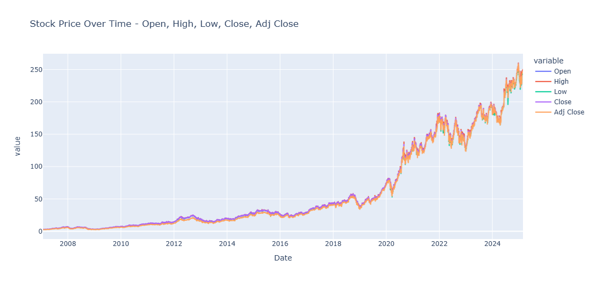
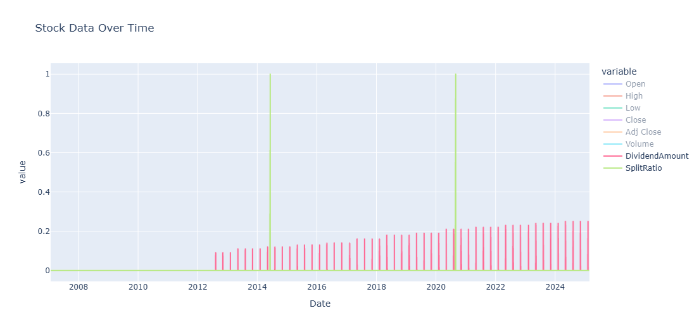
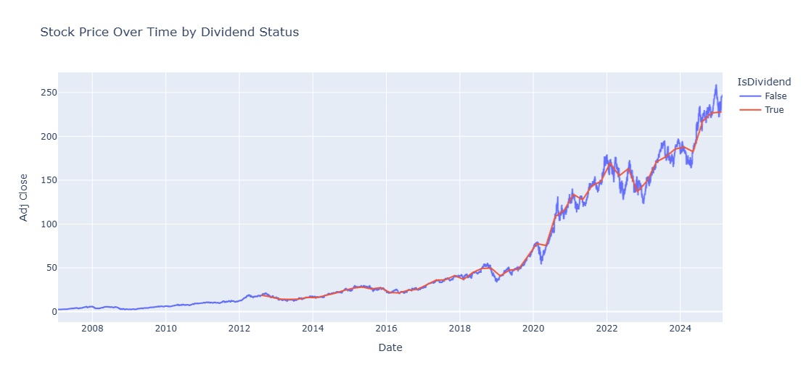
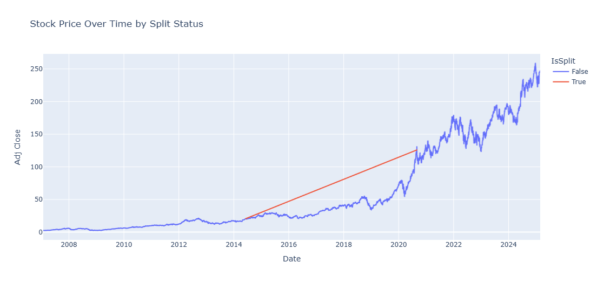
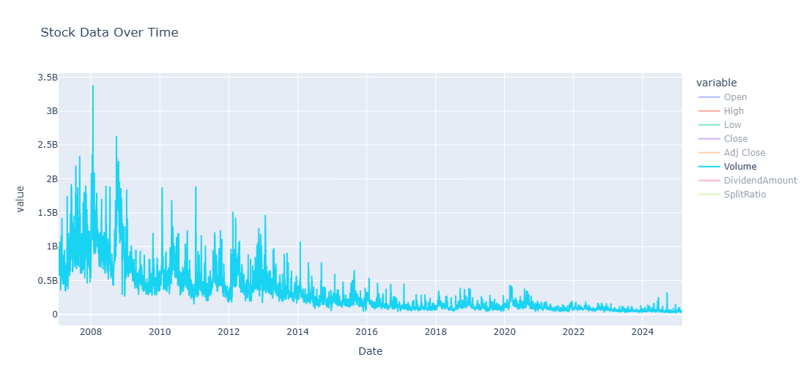

#  Stock Time Series Analysis Project

##  Project Overview

This comprehensive project analyzes **stock price time series data** to understand market behavior and identify patterns. The analysis focuses on examining price movements, dividend distributions, stock splits, and trading volume patterns over time.

---

## Data Analysis & Visualizations

### 1. **Stock Price Comparison Analysis**

**Description:** This chart displays the evolution of five key price metrics (Open, High, Low, Close, Adj Close) from 2008 to 2024. The visualization reveals:
- **Steady growth** from 2008-2018 with prices remaining below $50
- **Exponential growth** starting in 2019, reaching over $250 by 2024
- **Strong correlation** between all price metrics, indicating consistent market behavior
- **Minimal gaps** between Open/Close prices, suggesting stable trading patterns

---

### 2. **Stock Events Timeline Analysis**

**Description:** This normalized view shows the timing and frequency of corporate actions:
- **Dividend payments** (pink bars) began around 2013 and became regular quarterly events
- **Stock splits** (green spikes) occurred at strategic points: ~2014 and ~2020
- **Volume patterns** remain relatively stable throughout the timeline
- **Corporate maturity** is evident as the company transitioned from growth-focused to dividend-paying

---

### 3. **Dividend Impact Analysis**

**Description:** Comparison of stock performance during dividend-paying vs non-dividend periods:
- **Pre-2013:** No dividends, steady but slow growth
- **Post-2013:** Regular dividends with accelerated price appreciation
- **Identical trajectories** for both lines after 2013, indicating dividends didn't negatively impact growth
- **Value creation:** Shareholders benefited from both capital appreciation and income

---

### 4. **Stock Split Impact Analysis**

**Description:** Analysis of stock splits and their effect on price trajectory:
- **Red line** shows the theoretical price path without splits (reaching ~$125 by 2020)
- **Blue line** represents actual split-adjusted prices (continuing to ~$250+ by 2024)
- **2014 Split:** Moderate impact on accessibility
- **2020 Split:** Major split that significantly improved stock liquidity
- **Post-split growth:** Continued strong performance after each split event

---

### 5. **Trading Volume Patterns**

**Description:** Trading activity and liquidity analysis:
- **Highest volume:** Early years (2008-2012) with peaks reaching 3.5B shares
- **Volume decline:** Gradual decrease from 2012 onwards as stock matured
- **Current levels:** Stabilized around 100-500M shares daily
- **Market maturity:** Lower volatility and volume indicate institutional ownership growth
